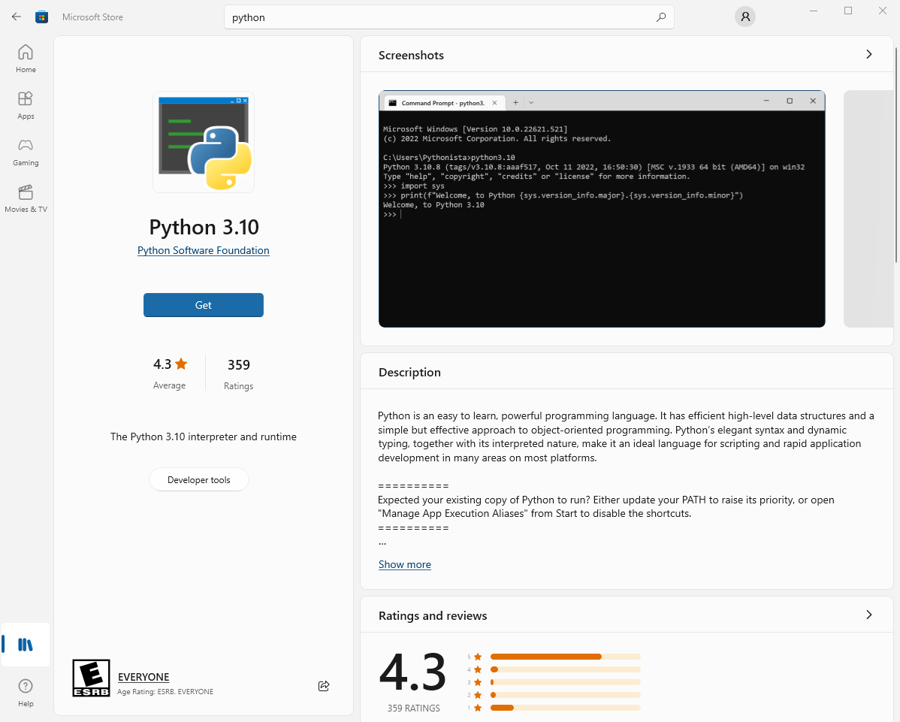
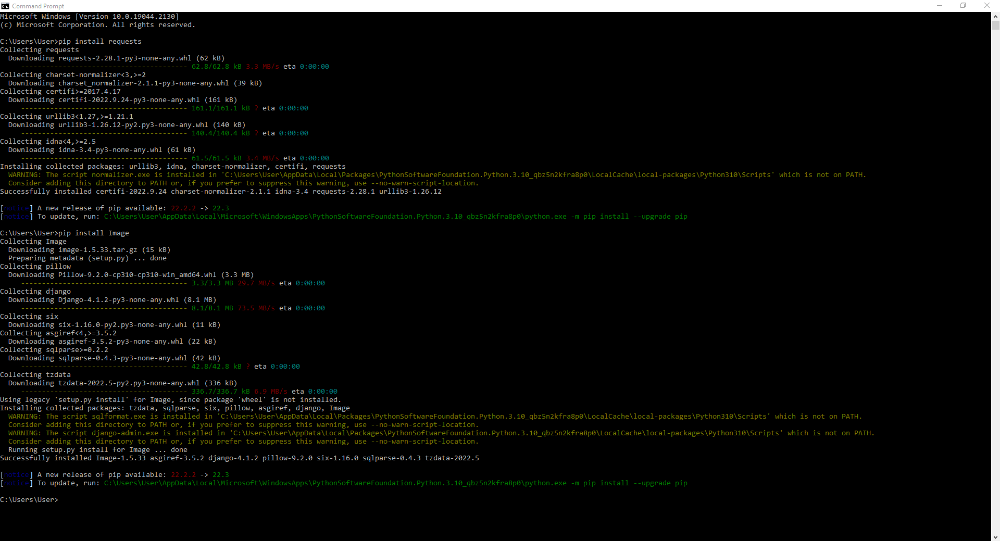
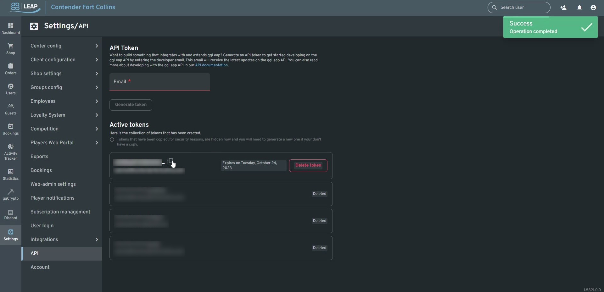
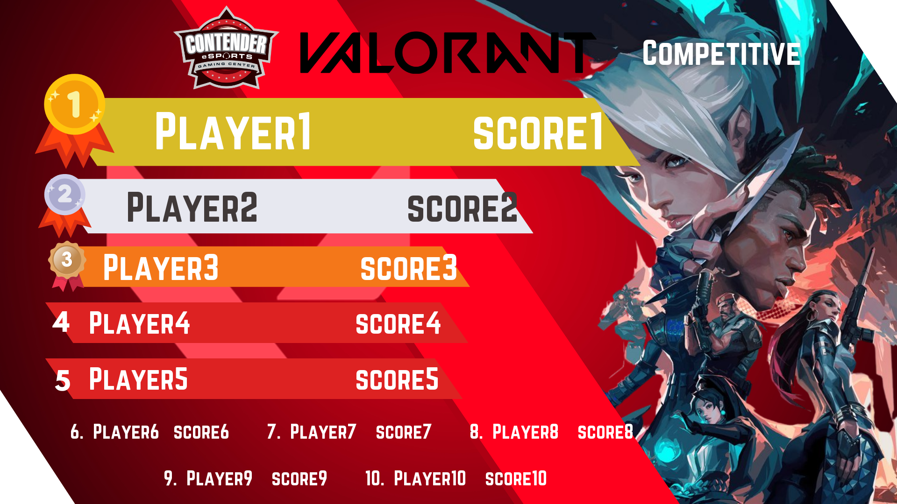

# GGleap leaderboard python script

This script uses the GGleap api to pull leaderboard scores and create custom scoreboards for the top 10 players. You'll want a computer at your center running this 24/7 for constant updates. For a video tutorial look here: https://youtu.be/HW_t9iy3i0Q

## Step 1: Install Python and required libraries

You can either install python from their website https://www.python.org/ or from the microsoft store. This tutorial will be using the microsoft store version.

Open up the microsoft store and search for python, click on the latest verions (3.10 as of now) and then click get.

Once install you'll need to install 2 libraries `requests` and `Image` You can do this by opening up a command line window and entering the following 2 commands:

    pip install requests
    pip install Image

## Step 2: Extract files

Click the green code button then in the dropdown click Download ZIP.

After the download is complete go to your downloads folder and extract it. Once extracted you can move the files anywhere you'd like.
## Step 3: Getting and setting up your API token

Open up GGleap and go to Settings>API and enter in an email address it will generate a token below, copy it by clicking the icon to the right of it.

Open up the leaderboard.py file from the downloaded files into a text editor: notepad, VS code, or any IDE will work. Towards the bottom look for this line.

    key="yourkeyhere"

replace `yourkeyhere` with the GGleap API token you copied and save.

## Step 4: Running the script

Run `state_leaderboard.bat` and the script will start to run. By default it will update the leaderboards ever hour. Leaderboards are export to the `Leaderboards/` folder

## Step 5: Displaying the leaderboards on your center TVs

This may be different depending on what type of TVs your center has. We have amazon FireTVs so Amazon photos is being used.

1. Download Amazon photos desktop app from https://www.amazon.com/b?ie=UTF8&node=16384500011.
2. Login and select Backups on the left side.
3. Click add backup and navigate to the folder where your leaderboards are being kept `Leaderboards/` and click select folder
4. Leave all other settings the same click save, the leaderboards should now be automatically uploaded  to your Amazon Photos account.
5. In you amazon photos (https://www.amazon.com/photos) you should now see the uploaded leaderboards add them to a new album.
6. On the Amazon TVs select the amazon photos app and start a slideshow of the new album you just created.
7. Done!

## Customization

### Backgrounds

To change the backgrounds of the leaderboard just replace the png files in `blankboards` with ones that you created. Keep in mind they should share the same name for the script to work, `apex_bg.png` etc...

### Text font and position

To change the postion and font of the text is a little more complicated and requires some knowledge about python. The actual positions/fonts of the text are drawn on by this command:

    Draw.text(pos, text, font=font, fill=fill)

Where:

`pos` is the position of the text in `(x,y)` cordinates

`text` is a string of text.

`font` is the font file that you are using loaded by either `font=ImageFont.truetype(path, textsize)` (for .otf / .ttf fonts) or `font=ImageFont.load(path, textsize)`.

`fill` is the color of the text in `(r,g,b)` format

Putting this all together the script uses it like this:

    font = ImageFont.truetype(r'./Norwester 400.otf',100)
    Draw.text((330, 220), str(data[0][0]), font=font, fill=(255, 255, 255))
    
With `data` being an array that holds the playername and score taken from GGleap.

To change the drawn position of the text would be just a matter of changing the x and y of `(330,220)`

To change the text size you would need to change `100` in the `ImageFont` command

To change the font itself you would need to download a new font and place it in the same directory as `leaderboard.py` and change `r'./Norwester 400.otf'` to `r'./NewFont.otf'`

Documentation of both of these commands can be found here:
https://pillow.readthedocs.io/en/stable/reference/ImageDraw.html
https://pillow.readthedocs.io/en/stable/reference/ImageFont.html

### Creating a custom scorecard

`data` is a 2D array formatted as such:

    [["Player1", "score1"],
     ["Player2", "score2"],
     ["Player3", "score3"],
     ["Player4", "score4"],
     ["Player5", "score5"],
     ["Player6", "score6"],
     ["Player7", "score7"],
     ["Player8", "score8"],
     ["Player9", "score9"],
     ["Player10","score10"]]

Creates this:

Normally this data is extracted from GGleap with the `getLeaderboard()` function but if you want to manually create a scorecard just create a new array `data` with the players and score you want for the scoreboard and create the board image with `boardexport(path,export,data,0)`

`path` is the path to your blank board I.E. `r'./blankboards/custom_bg.png'`

`export` is the path you want to export to I.E. `r'./Leaderboards/smash.png'`

`data` is the custom data  array you created.

The `0` value is useful is you quickly want to shift all text horizontally. A negative value will shift it left, a positive value will shift it right.
